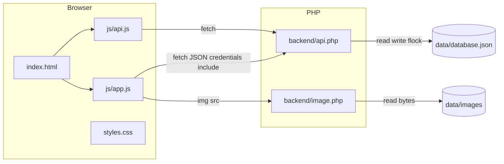

# Architecture

This document describes the **open-dating** prototype: a vanilla PHP JSON API, a single-page app in vanilla JavaScript, and file-based persistence. For a short tree overview, see [README.md](README.md).

## Purpose and scope

The app is a **demo-style dating flow**: browse a feed, like or pass, see mutual **matches**, see who **liked** you, **chat** only with matches, edit **match preferences**, and switch the **active user** (for local testing). There is **no real authentication**—identity is whichever `username` is stored in the PHP session.

## High-level system

- **JSON API:** [`backend/api.php`](backend/api.php) — single entry point; dispatch via `?action=…` (no URL rewriting in the repo).
- **Images:** [`backend/image.php`](backend/image.php) — serves files under [`data/images/`](data/images/) with validated paths (no directory traversal).
- **Persistence:** [`data/database.json`](data/database.json) — loaded/saved with [`flock`](backend/lib/store.php) on each mutating request.

## Backend

### Entry and dispatch

- [`backend/api.php`](backend/api.php) starts a session, loads the database, ensures `$_SESSION['username']` is set from [`default_username`](data/database.json) if missing, then routes on **`$_GET['action']`** and **`$_SERVER['REQUEST_METHOD']`**.
- Responses are JSON; errors use `{ "error": "..." }` with appropriate HTTP status codes.

### API actions (as implemented)

| Method | `action` | Purpose |
|--------|----------|---------|
| GET | `session` | Current session username and full user object (including preferences). |
| POST | `session` | Set active user; JSON body `{"username": "..."}` or `{"id": "..."}`. |
| GET | `feed` | Next recommended profile or `null`. |
| POST | `feed_react` | Like/pass; body `username` and `type` (`like`, `pass`, or `nope`). Returns `{ "match": true/false }`. |
| GET | `likes` | Users who liked the current user (pending). |
| GET | `matches` | Matched users. |
| GET | `user` | Query `username` — public profile. |
| GET | `preferences` | Current user preferences. |
| POST | `preferences` | Update preferences (nested `preferences` or flat body). |
| GET | `interests` | Master interest list from JSON. |
| GET | `chats` | Match threads with last message preview. |
| GET | `chat_messages` | Query `with` — messages for a match. |
| POST | `chat_send` | Query `with` — body `{"message": "..."}`. |
| GET | `users` | Other users (for the profile switcher). |
| POST | `admin_clear` | Dev reset. JSON body: `what` (`likes`, `matches`, or `messages`) and `scope` (`me` or `all`). Scope `me` removes rows involving the session user; `all` clears that category globally (messages: all chat threads). |

Unknown `action` → 404 JSON.

### Layers

| Module | Role |
|--------|------|
| [`backend/lib/store.php`](backend/lib/store.php) | `db_load()` / `db_save()` — read/write `data/database.json` with file locking. |
| [`backend/lib/service.php`](backend/lib/service.php) | Feed scoring, validation, likes/matches, react, chats. |
| [`backend/lib/pictures.php`](backend/lib/pictures.php) | `pic_urls_for()` builds relative `backend/image.php?…` URLs; maps `/static/images/…` or paths containing `avatar` to shared `avatar.png`; otherwise `data/images/<username>/<basename>`. |
| [`backend/api.php`](backend/api.php) | `api_expand_user()` — merges interest metadata and `picture_urls` for JSON responses. |

### Session model

- **Session key:** `$_SESSION['username']` (string).
- **Bootstrap:** If unset or invalid, the username is set from `default_username` in the JSON file.
- **Dev switcher:** POST `session` overwrites the session user so you can test flows as different profiles.

## Data model

[`data/database.json`](data/database.json) is the single source of truth. Top-level keys include:

- **`users`** — array of user objects: `username`, `name`, `age`, `gender`, `location`, `bio`, `pictures` (filenames), `interests` (interest ids), `preferences` (gender flags, `age_min`, `age_max`, `distance_meters`), `seen_users`, and per-user `likes` arrays in the file that are **not** used by this PHP stack for global like state.
- **`likes`** — global list of `{ liker, liked, timestamp }` — **authoritative** for likes and feed logic.
- **`matches`** — `{ user1, user2, match_date }`.
- **`chats`** — `{ user1, user2, messages[] }` with message objects.
- **`interests`** — catalog of `{ id, name, icon? }`.
- **`default_username`** — seed user when the session has no user.

Writes persist the entire JSON document after each mutation.

## Frontend

- **Shell:** [`index.html`](index.html) loads [`styles.css`](styles.css), [`js/api.js`](js/api.js), [`js/app.js`](js/app.js).
- **Routing:** Hash-based URLs (`#/feed`, `#/likes`, `#/matches`, `#/chats`, `#/profile`, `#/chat/:user`, `#/user/:user`) in [`js/app.js`](js/app.js) — no server rewrite required for deep links.
- **API client:** [`js/api.js`](js/api.js) — `fetch` to `backend/api.php?…` with `credentials: "include"`. Optional **`window.__API_BASE__`** prefix for deployments under a subpath (e.g. `/git/open-dating/`).
- **UI:** [`styles.css`](styles.css) — mobile-first layout, bottom navigation, large tap targets, safe-area insets.

## Deployment

- Serve the **repository root** (or equivalent) with a PHP-capable server (e.g. XAMPP Apache) so `index.html`, `backend/*.php`, and static assets share one **origin**; session cookies require same-origin `fetch` with credentials.
- No `.htaccess` is required; URLs are explicit (`backend/api.php`, `backend/image.php`).

## Known limitations

- **No real authentication** — anyone who can hit the API with a valid session cookie can use the app; the user switcher is for development only.
- **`distance_meters`** is stored on preferences and editable in the UI but **not** used in feed eligibility — only **age** and **gender** match in [`svc_prefs_match_user`](backend/lib/service.php) / [`svc_is_eligible_for_feed`](backend/lib/service.php).
- **Global `likes` filter:** [`svc_is_eligible_for_feed`](backend/lib/service.php) excludes candidates if any row in `likes` has `liked` equal to that candidate’s username (legacy behavior inherited from the original prototype).
- **Concurrency:** a single JSON file; `flock` reduces corruption risk but does not scale like a real database.
- **Chat:** REST only; no WebSockets or server-sent events.

## License

See [LICENSE](LICENSE).
