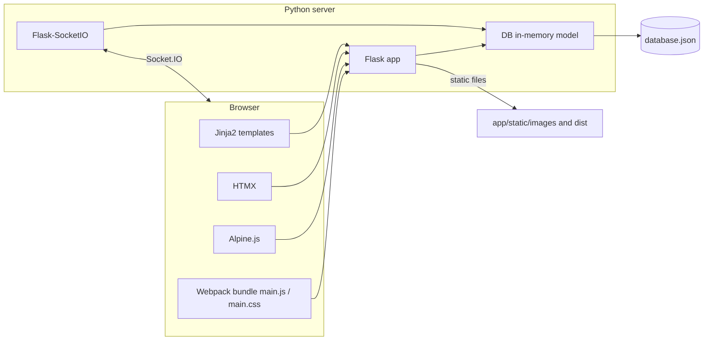

# Architecture

This document describes how the **open-dating** (Flask prototype application) application is structured: runtime entry points, server modules, persistence, frontend build, and known limitations.

The **[README](README.md)** install steps are still useful, but its **code tree is outdated**; paths and layout in **this file** match the repo. Project license: **[LICENSE](LICENSE)**.

## Purpose and scope

The app is a **demo-style dating experience**: browse a feed of profiles, like or pass, form **matches** when two users like each other, view likes and matches, edit **preferences** (age, gender, and a stored **distance** field), and **chat** with matches. **Distance** is persisted on `Preferences` but is **not** applied in `Preferences.check_user` or the main feed eligibility logic—only age and gender are. **Communities** routes render mostly placeholder UI. There is **no real authentication**: the active user is whichever `username` is stored in the Flask **session**. On first visit, `ensure_current_user` in [`app/routes.py`](app/routes.py) assigns a default username from the database; clients can switch the active user via `POST /active_user` (useful for local testing).

## High-level system diagram

## Runtime and entry points

| Mode | How | Notes |
|------|-----|--------|
| Development | `python run.py` from the repo root | [`run.py`](run.py) calls `socketio.run(app, port=8080, debug=True)` so HTTP and Socket.IO share the same process. |
| Flask CLI | `flask` with `FLASK_APP` pointing at the app | See [`.flaskenv`](.flaskenv): it sets `FLASK_APP="opendating"`, which does **not** match the actual package name `app`. Prefer `FLASK_APP=app` or running via `run.py` / `gunicorn app:app`. |
| Production (Heroku-style) | [`Procfile`](Procfile): `gunicorn app:app` | Standard **gunicorn** is WSGI-only. **Socket.IO** used for live chat may require a different worker or hosting setup (e.g. eventlet/gevent or a dedicated Socket.IO service). Treat current Procfile as a baseline, not a full real-time deployment recipe. |

Configuration is loaded from [`app/config.py`](app/config.py): `DATABASE_FILE` (default `database.json`), `WEBPACK_MANIFEST_PATH`. The manifest path is available for tooling; [`app/templates/base.html`](app/templates/base.html) hardcodes `static/dist/main.js` and `main.css` rather than reading the manifest. Secrets and env: `python-dotenv` in [`app/__init__.py`](app/__init__.py); `flask gen-secret` writes `SECRET` to `.env`.

**Session signing:** In [`app/__init__.py`](app/__init__.py), `SECRET_KEY` is set from `SECRET`, then **`app.secret_key = os.urandom(24)`** runs immediately after, which **overrides** the config value. Flask uses `app.secret_key` for sessions, so **sessions are signed with a new random key on every process start**—`flask gen-secret` does **not** produce stable session cookies across restarts unless that line is removed or aligned with `SECRET`.

## Backend layout

### Application factory

[`app/__init__.py`](app/__init__.py) defines `create_app()`:

- Instantiates [`DB`](app/db.py) with `DATABASE_FILE`.
- Registers blueprints (see below), then `configure_api_and_processors(app, database)`.
- Initializes **Flask-SocketIO** (`socketio.init_app(app)`) and **Flask-Compress**.
- Exposes a module-level `app = create_app()` for WSGI servers and `run.py`.

### Cross-cutting behavior

[`app/routes.py`](app/routes.py) `configure_api_and_processors`:

- **`@app.before_request` / `ensure_current_user`**: ensures `session["username"]` exists (uses `db.default_username`).
- **`GET|POST /active_user`**: read or set the session user (JSON body `{"id": "<username>"}` on POST). The `GET` handler returns a dict using Python’s built-in `id` as the key (not the string `"id"`), so clients expecting `{"id": "..."}` should be aware of this quirk.
- **`POST /reload_json`**: reloads the database from disk (`db.load()`).
- **Context processors**: inject `users`, `active_user`, `currentPreferences`, `get_image_path` into templates.

**User switcher UI:** [`app/templates/_user_switch.html`](app/templates/_user_switch.html) (Alpine + `fetch` `POST` to `active_user` with JSON `{"id": "<username>"}`) is included where navigation is wired.

### Blueprints and routes

**Dating** — blueprint `dating_bp`, no URL prefix — [`app/dating/routes.py`](app/dating/routes.py)

| Route | Description |
|-------|-------------|
| `GET /` | Feed: one recommended user via `get_feed_recommendation` ([`app/algo.py`](app/algo.py)). |
| `GET /users/<user>` | Profile page for a username. |
| `POST /<user>/react` | JSON `{"type":"like"|"nope"}`: records like or skip, may create a **match**. |
| `GET /likes` | Lists incoming likes and matches. |
| `GET /profile` | Current user profile. |
| `GET /all`, `GET /all/filtered` | Browse all profiles (filtered flag for template behavior). |
| `POST /profile/edit_profile` | Multipart upload of profile images. |

**Messages** — `messages_bp`, prefix **`/messages`** — [`app/messages/routes.py`](app/messages/routes.py)

| Route / handler | Description |
|-----------------|-------------|
| `GET /messages/` | Chat list for matches. |
| `GET /messages/<user>` | Chat view with one match. |
| `POST /messages/<user>/send` | JSON `{"message": "..."}` append message and persist. |
| `@socketio.on("chatmessage")` | Real-time path: append message, `emit("messagereceived", ...)`, `db.save()`. |

**Communities** — `communities_bp`, prefix **`/communities`** — [`app/communities/routes.py`](app/communities/routes.py)

| Route | Description |
|-------|-------------|
| `GET /communities/` | Community index template. |
| `GET /communities/community/<name>` | Single community page. |
| `GET /communities/community/<name>/members` | Members placeholder. |

**API** — `api_bp`, prefix **`/api`** — [`app/api/routes.py`](app/api/routes.py)

| Route | Description |
|-------|-------------|
| `POST /api/preferences` | Form post from HTMX: updates preferences, returns HTML fragment + Lucide init script. |
| `GET /api/get_interest/<id>` | JSON for one interest by id. |
| `GET /api/next_user` | Calls `get_recommended_user()` (response is minimal; endpoint is thin). |
| `GET /api/all_users` | Removes the current user from the in-memory `users` list and returns the remainder (mutates the shared list). |
| `GET /api/all_users/filtered` | Users after `preference_filter`. |

### CLI commands

Registered in `add_cmdline_options` in [`app/__init__.py`](app/__init__.py):

- `flask db select-database <path>` — writes `DATABASE_FILE` to `.env`.
- `flask db init-db <path>` — creates DB via `init_new_db` in [`app/db.py`](app/db.py).
- `flask gen-secret` — writes `SECRET` to `.env`.

**Not exposed:** A `@click.command("reset-db")` handler is defined in the same function but **never** passed to `app.cli.add_command`, so **`flask reset-db` is unavailable**. [`reset_db` in `app/db.py`](app/db.py) exists for programmatic resets. If the command were registered as written, the inner function name `reset_db` would also shadow the import and recurse instead of calling `db.reset_db(db)`.

### Supporting modules

- [`app/util.py`](app/util.py): `random_hex_color` for UI color helpers.

## Data layer

[`app/db.py`](app/db.py) holds a single **`DB`** dataclass backed by **one JSON file** (`filename`). On startup the file is read into memory; mutations call `save()` which rewrites the whole file.

**JSON file shape (top-level keys):** Serialized via `dataclasses.asdict` on `DB` (minus `filename`). Typical keys: **`users`**, **`default_username`**, **`likes`**, **`matches`**, **`chats`**, **`interests`**. Each `user` embeds nested `preferences`, `pictures`, `interests`, `seen_users`, etc., matching [`User`](app/db.py) / `from_json`.

**`init_new_db`** ([`app/db.py`](app/db.py)): `flask db init-db` delegates here. The implementation is **fragile**: it calls `open(path)` on a **non-existent** file before `DB(path)` runs (where `DB.__init__` would create the file via `save()`), so the CLI path may **fail** in practice until this helper is fixed.

**Entities (conceptual):**

- **User**: profile fields, `pictures`, `interests`, `preferences` (`Preferences` + `GenderPreference`), `seen_users` for feed.
- **Like**, **Match**, **Chat** (pair of usernames + **Message** list).
- **Interest** master list with optional icon.

**Recommendation eligibility** (`validate_user_recommendation`): not self, not in `seen_users`, **excluded if any global `Like` has `liked == user.username`** (i.e. that profile has received at least one like from anyone—not only the current user), not already matched with the current user, and must pass `preferences.check_user` (age and gender only).

**Feed scoring** ([`app/algo.py`](app/algo.py)): among eligible users, `get_feed_recommendation` maximizes `calculate_recommendation_score` by **nested loops over both users’ `interests` lists**; for each pair of entries that compare equal (`int1 == int2`), score increases by `0.05` (typically interest ids as strings).

**Filtering** `preference_filter` in [`app/db.py`](app/db.py) is used by the API for filtered user lists (note: mutates list while iterating in the implementation).

**Images**: `get_image_path` uses Flask `url_for` to build **URL paths** for static images under `static/images/<username>/`. **`set_user_image`** passes that string into `os.path.join` for `image.save(...)`—so it does **not** receive a real filesystem directory path. As written, profile uploads are **unlikely to save correctly** until this is resolved (e.g. a dedicated filesystem path helper).

## Frontend

### Build pipeline

- **Package root:** [`assets/package.json`](assets/package.json).
- **Package manager:** Both [`assets/package-lock.json`](assets/package-lock.json) and [`assets/pnpm-lock.yaml`](assets/pnpm-lock.yaml) exist—pick **one** of npm or pnpm for installs; avoid mixing lockfiles on the same machine without reconciling.
- **Scripts:** `npm run dev` runs Tailwind watch and Webpack watch in parallel; `npm run build` builds Tailwind then Webpack.
- **Webpack** [`assets/webpack.config.js`](assets/webpack.config.js): entry [`assets/ts/index.ts`](assets/ts/index.ts) and [`assets/css/index.css`](assets/css/index.css); output goes to [`app/static/dist/`](app/static/dist/) (`main.js`, `main.css`, `manifest.json` via `WebpackManifestPlugin`).
- **Tailwind** reads [`assets/tailwind.config.js`](assets/tailwind.config.js); CSS is PostCSS-processed.

### Runtime libraries

Bundled entry [`assets/ts/index.ts`](assets/ts/index.ts):

- **HTMX** — `window.htmx`; `htmx:afterRequest` refreshes Lucide icons.
- **Alpine.js** — components: `userProfile`, `modal`, `checkbox`, `range`, `matchButtons`, `interest`.
- **Lucide** — `window.lucide()` for icons.

**Chat UI** ([`app/messages/templates/message-macros.html`](app/messages/templates/message-macros.html)): Alpine `messageBox` calls `socket.emit("chatmessage", {...})`. [`chat.html`](app/messages/templates/chat.html) registers `socket.on("messagereceived", () => window.location.reload())`.

**Integration gap:** `socket.io-client` is listed in [`assets/package.json`](assets/package.json), but [`assets/ts/index.ts`](assets/ts/index.ts) does **not** call `io()` or assign a global `socket`. Inline templates expect a global **`socket`**. Until the client is initialized in the bundle (or a script tag loads Socket.IO and connects), real-time chat may not work as designed; HTTP `POST /messages/<user>/send` still persists messages.

### Templates

- [`app/templates/base.html`](app/templates/base.html) — loads `static/dist/main.js` and `main.css`.
- [`app/templates/basic.html`](app/templates/basic.html) — shell with navigation includes.
- Feature templates live under `app/dating/templates`, `app/messages/templates`, `app/communities/templates`.
- Preferences form HTMX: see [`app/templates/includes/macros.html`](app/templates/includes/macros.html) (`hx-post="/api/preferences"`).

## Dependencies

- **Python:** [`requirements.txt`](requirements.txt) (Flask, Flask-SocketIO, Flask-Compress, python-dotenv, etc.).
- **Node:** [`assets/package.json`](assets/package.json) (Webpack, TypeScript, Tailwind, HTMX, Alpine, Lucide, socket.io-client).
- **License:** See [`LICENSE`](LICENSE).

Installation steps remain in [`README.md`](README.md).

## Testing and CI

The repository has **no automated test suite** (no `tests/` tree or pytest/unittest layout) and **no GitHub Actions workflows** under `.github/workflows` at the time of writing. Changes are validated manually.

## Extension points (for contributors)

- **New HTTP routes:** Add handlers inside an existing blueprint’s `register_routes(db)` or create a new blueprint module, register it in [`app/__init__.py`](app/__init__.py) (`register_blueprint(...)`), and call `register_routes` before or after other wiring as needed.
- **Persisted changes:** After mutating `DB` state (users, likes, chats, etc.), call **`db.save()`** unless you are only reading from disk. Missed saves are a common bug when adding features.
- **Socket.IO:** New events belong in [`app/messages/routes.py`](app/messages/routes.py) (or a dedicated module) with the shared `socketio` instance from [`app/__init__.py`](app/__init__.py).

## Operational limitations

- **Persistence:** Single JSON file; whole-db rewrite on `save()`. No transactions or safe concurrent writers—fine for a single local process, risky under real multi-process load.
- **Security:** Session cookie + optional `SECRET`; switching users via `/active_user` is not a security model—do not expose this pattern on the public internet as-is.
- **Deployment:** Match Socket.IO requirements to your WSGI/ASGI host if you rely on live chat.
